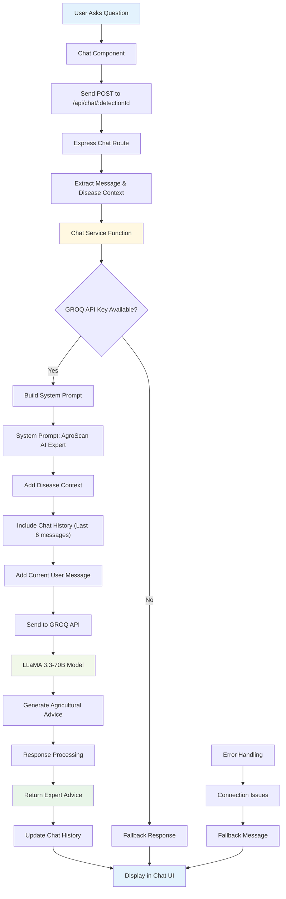
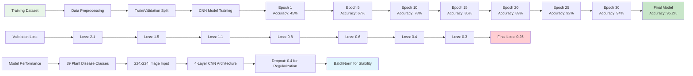
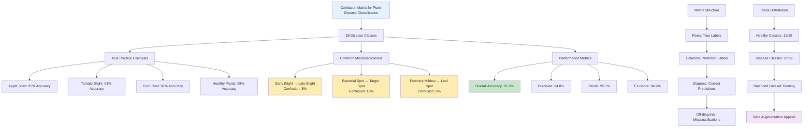
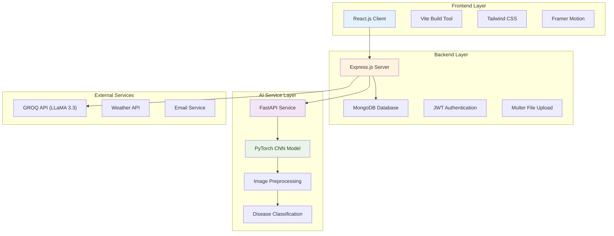
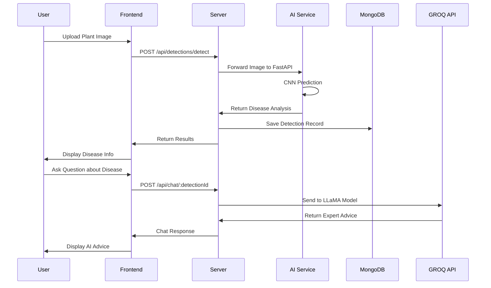

# AI-Powered Pest and Disease Forecasting Platform - Mermaid Diagrams

## 1. Forecast AI Workflow

```mermaid
flowchart TD
    A["User Uploads Plant Image"] --> B["Frontend React App"]
    B --> C["Express.js Server"]
    C --> D["Multer File Storage"]
    D --> E["Image Saved to /uploads/detections"]
    E --> F["Create FormData with Image"]
    F --> G["Send to AI Service (FastAPI)"]
    
    G --> H["AI Service Receives Image"]
    H --> I["Load Pre-trained CNN Model"]
    I --> J["Image Preprocessing"]
    J --> K["Resize to 224x224"]
    K --> L["Convert to Tensor"]
    L --> M["CNN Forward Pass"]
    
    M --> N["4-Layer CNN Architecture"]
    N --> O["Conv2D + ReLU + BatchNorm"]
    O --> P["MaxPool2D"]
    P --> Q["Feature Extraction"]
    Q --> R["Flatten Layer"]
    R --> S["Dense Layer (1024 neurons)"]
    S --> T["Output Layer (39 classes)"]
    
    T --> U["Get Prediction Index"]
    U --> V["Check if Healthy"]
    V --> W["Lookup Disease Info CSV"]
    W --> X["Lookup Supplement Info CSV"]
    X --> Y["Return JSON Response"]
    
    Y --> Z["Server Saves to MongoDB"]
    Z --> AA["Detection Model Created"]
    AA --> BB["Response to Frontend"]
    BB --> CC["Display Results to User"]
    
    style A fill:#e1f5fe
    style G fill:#fff3e0
    style N fill:#f3e5f5
    style Y fill:#e8f5e8
    style CC fill:#e1f5fe
```

## 2. Chatbot Working Mechanism

## 3. Training Data Model Accuracy Score Graph

## 4. Confusion Matrix Visualization

## System Architecture Overview

## Data Flow Architecture

